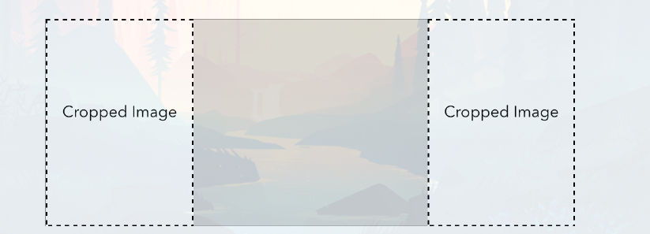

# sumy-arti

Article Summarization &amp; Automated Image Generation

## Motivation

If you have been using Instagram for a while, you might have already seen a lot of media outlets uploading stories about their latest articles on the platform.

as a programmer, I feel like it is too much effort to create story images manually for the articles I
publish. My frustration led me to automate most of the process.

## Installation

Install the requirements with pip:

```shell
pip install -r requirements.txt
```

## Usage

The easiest way to get started is to execute the `sumy-arti` file.

```shell
python sumy-arti.py
```

This will download the article and generate an image.

## How does it work?

The script takes an article and generates an image from it.

The article is downloaded from the url given by the user.

The article is parsed and the most important sentences are extracted.

The sentences are then overlayed on a cropped images.



**The image is saved in the `images` folder.**

## Authors

- **[Yusuf Adel](https://linkedin.com/in/yusufadell)**

## License

Copyright (c) 2022 Yusuf Adel.

This software is licensed under the MIT License.

## Code

- [Repository](https://github.com/yusufadell/sumy-arti)
